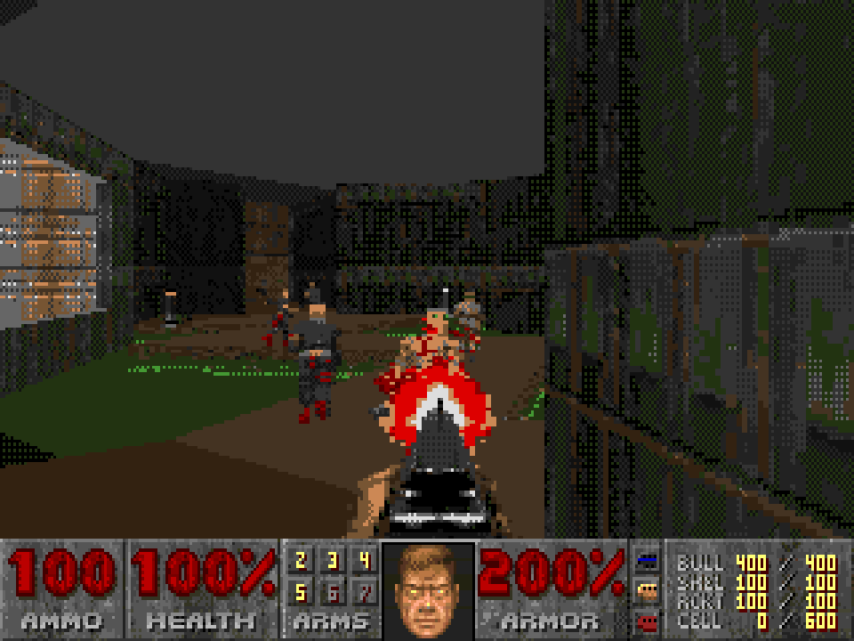

# Can it play Doom?

It's a question that's nagged at me since before I said goodbye to my trusty Apple IIgs over 30 years ago. (It was decked out with a whopping 8 MB RAM and 12.5 MHz ZipGS.) With the GS turning 40, I figured it was time to finally try answering it.

Inspired by [Doom8088](https://github.com/FrenkelS/Doom8088), it was first converted to 65816 assembly. That allowed full control of every knob and dial. Most of the work has been finding out where the accelerator spends its time waiting and where the assembly, initially just compiled from C, could be tightened up.

With no real IIgs available, development started on MAME's IIgs emulator. Iterating and testing code changes on the real thing would be too slow anyway. Unfortunately, MAME's ZipGS emulation skips some cache and bus timing. That required a [MAME fork](https://github.com/Webifi/mame/tree/apple2gs-accelerators) with, hopefully, more accurate ZipGS and TransWarp GS emulation.

There are compromises: a 160 x 168 view with double-wide pixels, reduced color palettes with dithering, flat-colored floors and ceilings, and less precise math where it seemed to have little effect. Walls keep their textures and lighting, but they're pretty ugly.

A lot of time was spent trying to work around the assumed single-entry write buffer of the ZipGS. The idea was to keep cached reads and register operations going after an 8-bit store to the slower motherboard bus and then avoiding as many stores as possible.

In the end, all I could get was a chunky ~4 FPS on my emulated IIgs with 8 MB and a 12 MHz ZipGS.  Without an accelerator, it would be more like seconds per frame.

So, *can it play Doom?*  I guess that depends on how you define "play".  Maybe?  Give it a try and let me know.

# Does it work on a real IIgs?

Seems so.  Thanks to bug reports from u/BenJets, u/chrisparana, and others in the Apple II community, it now loads and runs on real hardware at the predicted framerates.

# What makes it faster

The main things that let the engine get to ~4 FPS are:

* Lower resolution. The view is 160 x 168 with double-wide pixels, so there's half as much to draw. In the IIgs's 320-pixel super hi-res mode each byte holds two pixels, so one byte write fills one double-wide pixel.
* No floor or ceiling textures. Each floor and ceiling gets a single color picked from its texture and light level. Drawing it is a plain fill instead of a texture lookup for every pixel.
* Precalculated tables. Doom's 256 colors and 32 light levels are mapped to each level's 16-color palettes when the game is built, so the engine looks colors up instead of calculating them. The 65816 has no multiply instruction, so multiplication uses a table of squares instead.
* Collect first, then draw. While the frame is worked out, the walls, floors and sprites of each screen column go into a list for that column. When the frame is done, the columns are drawn from their lists, left to right. Each pixel pair written to screen memory takes about 1 µs (around 12 cycles at 12 MHz) to drain from the accelerator's write buffer, and the drawing code uses that wait to fetch the next texel and work out its color. We're able to use about 90% of those otherwise often stalled cycles, though when we're too slow you can see the frame getting painted.

# Wanna try?

Minimum requirements: A working IIgs, 4 MB RAM (8 MB recommended) and a 12 MHz ZipGS or TransWarp GS accelerator with at least 32 KB cache. You'll also need a 3.5" drive and 4 blank 800 KB floppies, or some other way to load the image(s).

Get the [disk images](https://github.com/Webifi/iigs-doom/releases/latest).
